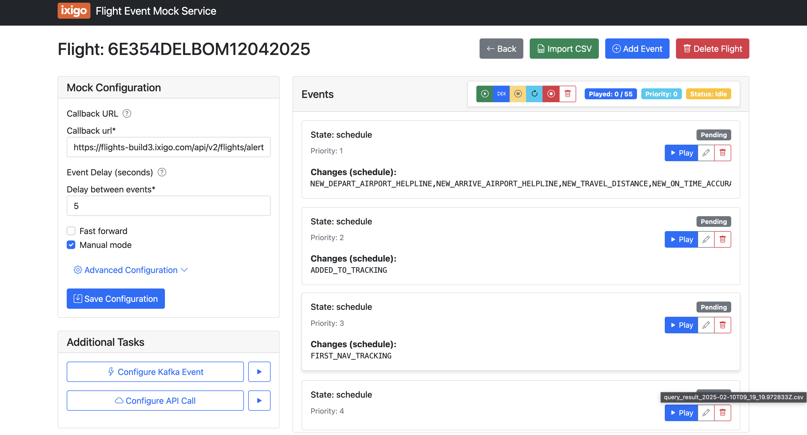

# Flight Test Automation Tool

A powerful tool to simulate flight status events for testing and development purposes. This application allows you to create, configure, and replay flight events through a user-friendly web interface.



## Features

- Create and manage multiple flight test sessions
- Define custom event sequences with configurable priorities
- Import event data from CSV files
- Real-time event playback with configurable delays
- Manual or automatic event sequencing
- Database cleanup tools with custom query support
- Kafka event production capabilities
- API call simulation

## Table of Contents

- [Prerequisites](#prerequisites)
- [Setup Options](#setup-options)
  - [Option 1: Docker Compose (Recommended)](#option-1-docker-compose-recommended)
  - [Option 2: Local Python with Docker Database](#option-2-local-python-with-docker-database)
  - [Option 3: Fully Local Setup](#option-3-fully-local-setup)
- [Configuration](#configuration)
- [Usage Guide](#usage-guide)
- [Development](#development)
- [Troubleshooting](#troubleshooting)

## Prerequisites

- Python 3.8+ (if running locally)
- Docker and Docker Compose (for containerized setup)
- Git

## Setup Options

Choose one of the following setup options based on your preferences and environment.

### Option 1: Docker Compose (Recommended)

This option runs both the web application and PostgreSQL database in Docker containers.

1. Clone the repository:
   ```bash
   git clone https://github.com/yourusername/vf-test-automation.git
   cd vf-test-automation
   ```

2. Copy the sample environment file to create your `.env` file:
   ```bash
   cp .env.example .env
   ```
   
   The sample file already contains all necessary configuration variables. You can edit this file if you need to customize any settings.
   >  Ensure the value of the variable POSTGRES_HOST in your .env file (Use value 'db' for when using postgres on Docker, 'localhost' for local)

4. Build and start the containers:
   ```bash
   docker-compose up -d
   ```

5. Create database migrations and superuser:
   ```bash
   docker-compose exec web python manage.py migrate
   docker-compose exec web python manage.py createsuperuser
   ```

6. Access the application at http://localhost:8000

### Option 2: Local Python with Docker Database

Run the application locally while using a Docker container for the PostgreSQL database.

1. Clone the repository:
   ```bash
   git clone https://github.com/yourusername/vf-test-automation.git
   cd vf-test-automation
   ```

2. Copy the sample environment file to create your `.env` file:
   ```bash
   cp .env.example .env
   ```
   
   Edit the `.env` file to update the POSTGRES_HOST to point to the local Docker instance:
   ```
   POSTGRES_HOST=localhost
   ```

3. Start the PostgreSQL container:
   ```bash
   docker-compose up -d db
   ```

4. Create and activate a virtual environment:
   ```bash
   # On macOS/Linux
   python -m venv venv
   source venv/bin/activate

   # On Windows
   python -m venv venv
   venv\Scripts\activate
   ```

5. Install required packages:
   ```bash
   pip install -r requirements.txt
   ```

6. Run migrations and create a superuser:
   ```bash
   python manage.py migrate
   python manage.py createsuperuser
   ```

7. Start the development server:
   ```bash
   python manage.py runserver
   ```

8. Access the application at http://localhost:8000

### Option 3: Fully Local Setup

Run both the application and database locally without Docker.

1. Install PostgreSQL on your machine
   - [PostgreSQL Downloads](https://www.postgresql.org/download/)
   - Create a database named `flight_mock_db`
   - Create a user `postgres` with password `postgres` (or use your own credentials)

2. Clone the repository:
   ```bash
   git clone https://github.com/yourusername/vf-test-automation.git
   cd vf-test-automation
   ```

3. Copy the sample environment file to create your `.env` file:
   ```bash
   cp .env.example .env
   ```
   
   Edit the `.env` file to update the POSTGRES_HOST to point to your local PostgreSQL instance:
   ```
    POSTGRES_DB=flight_mock_db
    POSTGRES_USER=postgres
    POSTGRES_PASSWORD=postgres
    POSTGRES_HOST=localhost
    POSTGRES_PORT=5432
   ```

4. Create and activate a virtual environment:
   ```bash
   # On macOS/Linux
   python -m venv venv
   source venv/bin/activate

   # On Windows
   python -m venv venv
   venv\Scripts\activate
   ```

5. Install required packages:
   ```bash
   pip install -r requirements.txt
   ```

6. Run migrations and create a superuser:
   ```bash
   python manage.py migrate
   python manage.py createsuperuser
   ```

7. Start the development server:
   ```bash
   python manage.py runserver
   ```

8. Access the application at http://localhost:8000

## Configuration

### Database Connection

You can configure the database connection in the `.env` file or directly in the Django settings.

## Usage Guide

### Creating a New Flight

1. Navigate to the main page and click on "Create New Flight"
2. Enter a unique Flight ID
3. Configure the Callback URL where events will be sent
4. Set the event delay and other configuration options
5. Click "Create" to set up the flight

### Adding Events

1. Open the flight detail page
2. Click "Add Event" 
3. Fill in the event details and JSON payload
4. Set the priority (or leave as 0 to auto-assign)
5. Click "Add Event"

### Running a Mock Session

1. Configure the cleanup query if needed (in the Advanced Configuration section)
2. Click the "Start Session" button to begin
3. Events will be sent to your callback URL in sequence
4. Use the "Next Event" button to advance manually in manual mode
5. Use "Pause," "Reset," or "Abort" to control the session

### Cleanup Queries

1. Expand the "Advanced Configuration" section
2. Enter your SQL query or use the default
3. Use the placeholder `{flight_unique_id}` to reference the current flight
4. Click the play button to execute the query

## Development

### Project Structure

```
vf-test-automation/
├── event_manager/          # Main Django app
│   ├── models.py           # Database models
│   ├── views.py            # View functions
│   ├── urls.py             # URL routing
│   ├── forms.py            # Form definitions
│   ├── admin.py            # Admin site configuration
│   └── templates/          # HTML templates
│       └── event_manager/  # App-specific templates
├── templates/              # Project-level templates
├── static/                 # Static files (CSS, JS, images)
├── vf_test_automation/     # Project settings
│   ├── settings.py         # Django settings
│   ├── urls.py             # Project URL routing
│   └── wsgi.py             # WSGI configuration
├── manage.py               # Django management script
├── requirements.txt        # Python dependencies
└── docker-compose.yml      # Docker configuration
```

### Adding New Features

1. Fork the repository
2. Create a feature branch (`git checkout -b feature/amazing-feature`)
3. Implement your changes
4. Test thoroughly
5. Submit a pull request

## Troubleshooting

### Database Connection Issues

If you encounter database connection problems:

1. Verify the database service is running
2. Check that your connection settings are correct
3. For Docker setups, ensure the containers are properly linked

### Missing Dependencies

If you get import errors:

1. Ensure your virtual environment is activated
2. Update your requirements: `pip install -r requirements.txt`
3. Restart the application

### Running Migrations

If database tables are missing:

```bash
python manage.py makemigrations
python manage.py migrate
```

## License

This project is licensed under the MIT License - see the LICENSE file for details. 
